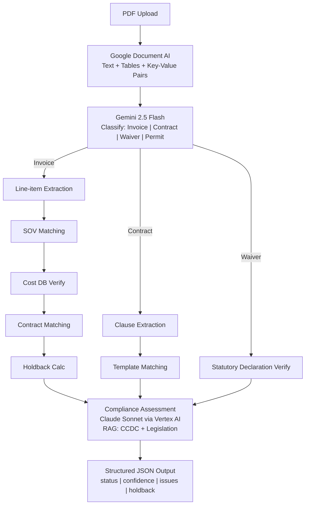

# P2: AI INVOICE/CONTRACT (Months 2-4)

## What Gets Built
The AI document processing pipeline. The core value: upload a PDF, get structured data back with compliance assessment.

## Components

| Component | Description | Why It's Needed |
|-----------|-------------|-----------------|
| **OCR Pipeline** | Google Document AI → structured text extraction | Current demo uses filename-based parsing. Real OCR extracts from actual PDF content. |
| **Contract AI Agent** | RAG pipeline: CCDC/FIDIC/JCT templates + provincial legislation → Claude/Gemini reasoning | Enables: "Is this invoice compliant with CCDC 2 clause 5.3?" |
| **Invoice Validation Agent** | Multi-step: OCR → line-item extraction → contract matching → cost DB price verify → holdback calc → compliance | The full pipeline that replaces 1-3 hours of manual SOV reconciliation. |
| **Vector Embeddings** | Embed CCDC docs, provincial lien acts, contract templates into pgvector | RAG retrieval for compliance agent. The knowledge base. |
| **Fraud Detection Sub-Agent** | Synthetic document detection, duplicate invoice flagging, anomaly scoring | Protects QS firm from professional liability. |

## Architecture Decisions

| Decision | Options | Chosen | Rationale |
|----------|---------|--------|-----------|
| AI Platform | Direct APIs, AWS Bedrock, Azure AI, Vertex AI | **Vertex AI** | Enterprise security (VPC-SC, CMEK), RAG Engine, Context Caching, consolidated billing, startup credits |
| OCR | Google Doc AI, Textract, Azure Doc Intel, Mindee | **Google Document AI** | Best accuracy on forms/tables, $0.0015-$0.01/page, FR/EN support, native Vertex AI integration |
| LLM (extraction) | Gemini Flash, GPT-4o mini, Claude Haiku | **Gemini 2.5 Flash (via Vertex AI)** | $0.30/1M input, Context Caching drops to $0.0375 for CCDC templates |
| LLM (reasoning) | Gemini Pro, Claude Sonnet, GPT-4o | **Claude Sonnet 4.6 (via Model Garden)** | Best at complex reasoning, contract interpretation |
| RAG | LangChain + pgvector, Vertex RAG Engine, LlamaIndex | **Vertex AI RAG Engine + pgvector** | Free ingestion/parsing/chunking, enterprise grounding at $2.50/1K requests |
| Agent framework | LangGraph, CrewAI, AutoGen | **LangGraph on Vertex AI Agent Builder** | State machine pipelines, $0.01/vCPU-hr runtime, integrated evaluation |

## AI Pipeline Detail

## Target Metrics

| Metric | Current (Demo) | P2 Target |
|--------|---------------|-----------|
| Invoice extraction accuracy | ~60% (filename-based) | **95%+** |
| Contract clause identification | None | **90%+** |
| Compliance assessment accuracy | ~70% (prompt-only) | **92%+** |
| Processing time per document | N/A | **< 30 seconds** |
| Fraud detection (synthetic docs) | None | **85%+ recall** |

---

## References

- [Vertex AI Platform](https://cloud.google.com/vertex-ai)
- [Vertex AI Generative AI Pricing](https://cloud.google.com/vertex-ai/generative-ai/pricing)
- [Vertex AI RAG Engine](https://cloud.google.com/vertex-ai/generative-ai/docs/rag-overview)
- [Google Document AI Pricing](https://cloud.google.com/document-ai/pricing)
- [AWS Textract Pricing](https://aws.amazon.com/textract/pricing/)
- [Claude API Pricing](https://docs.anthropic.com/en/docs/about-claude/models)
- [LangGraph](https://langchain-ai.github.io/langgraph/)
- [CCDC Contracts](https://www.ccdc.org/resources/contracts/)
