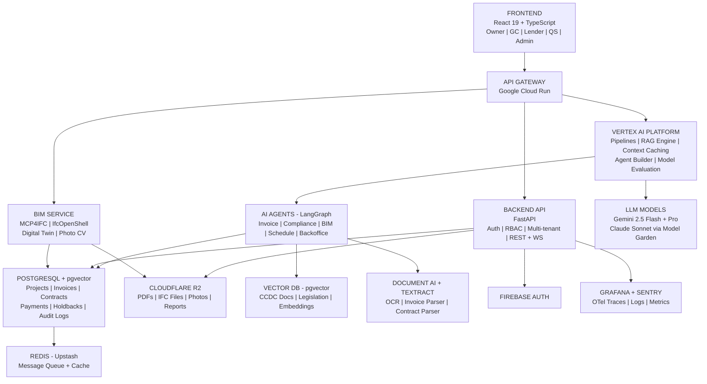
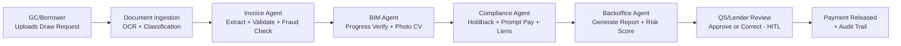
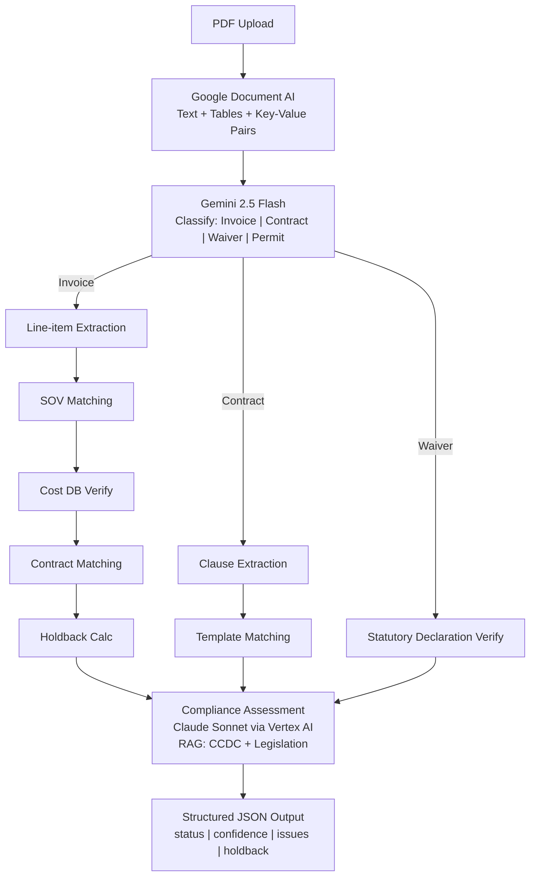

# MUNERA DILIGENCE — SYSTEM ARCHITECTURE & POC JUSTIFICATION
## Phased Roadmap with Component Pricing & Design Options
### February 26, 2026

---

# EXECUTIVE SUMMARY — $1.5M / 24 MONTHS

## Cost Summary

| Category | 24-Month Total | % of Budget |
|----------|---------------|-------------|
| **Cloud & AI Infrastructure** | $29,580 | 2.0% |
| **Software Licenses & Tools** | $42,000 | 2.8% |
| **SOC 2 Compliance** | $64,000 | 4.3% |
| **Operations** (legal, insurance, office, travel, data) | $155,000 | 10.3% |
| **TOTAL PLATFORM** | **$290,580** | **19.4%** |
| **PERSONNEL** (engineering, CTO, QA, contractors) | **$1,209,420** | **80.6%** |
| **TOTAL** | **$1,500,000** | **100%** |

*Cloud infrastructure at list price is $50K, reduced to $30K via Google for Startups AI credits ($350K over 2 years).*

## Infrastructure

| Layer | Technology | Monthly Cost | Why |
|-------|-----------|-------------|-----|
| AI Platform | **Vertex AI** (Pipelines, RAG Engine, Agent Builder) | $50-$250 | Enterprise security (VPC-SC, CMEK), Context Caching (90% LLM savings), consolidated audit logging |
| LLM Models | **Gemini 2.5 Flash** (90%) + **Claude Sonnet** (10%) via Vertex AI | $200-$1,600 | Flash for extraction, Sonnet for compliance reasoning |
| Backend | **Cloud Run** (FastAPI, auto-scale to zero) | $50-$400 | Pay-per-request, Montreal region, no idle cost |
| Database | **Supabase** (PostgreSQL + pgvector + RLS) | $75-$250 | DB + vector + auth + storage in one, SOC 2 at Team tier |
| Storage | **Cloudflare R2** (zero egress) | $20-$80 | PDFs, IFC files, photos — 60-80% cheaper than S3 |
| OCR | **Google Document AI** | $100-$600 | Best FR/EN accuracy, $0.0065/page, native Vertex integration |
| BIM | **Hetzner Dedicated** (IfcOpenShell + MCP4IFC) | $0-$90 | CPU-intensive processing at 1/4 the cost of cloud VMs |
| Observability | **Grafana Cloud + Sentry** (OTel) | $0-$100 | Free tier covers P0-P4, production-grade at $100/mo |

## Operations

| Item | Annual Cost | Notes |
|------|-----------|-------|
| Google Workspace (5-8 users) | $2,000 | Email, docs, calendar |
| CCDC contract licensing | $3,000 | Full suite: 2, 5A, 5B, 9A, 9B, 17, 30 |
| Compliance platform (Sprinto) | $8,000 | SOC 2 + ISO 27001 automation |
| Security scanning (Snyk + SonarQube) | $5,000 | SAST + SCA + dependency alerts |
| Insurance (E&O + Cyber) | $6,000 | Professional liability + cyber coverage |
| Coworking (Centech subsidized) | $9,000 | Free Year 1 via Centech, budget for growth |
| Accounting + bookkeeping | $7,500 | Monthly books + SR&ED prep |
| Legal (contracts, IP) | $10,000 | Partnership agreements, IP protection |
| Travel (pilot sites, investors) | $10,000 | Montreal-area pilot visits + conferences |

## Risk Matrix

| Risk | Impact | Likelihood | Mitigation |
|------|--------|-----------|------------|
| **AI accuracy below 90%** | High | Medium | HITL review catches errors; shadow deployment (P7) validates before go-live; Vertex AI evaluation tools benchmark continuously |
| **Quebec prompt payment deadline missed** | High | Low | P4 targets compliance engine by Month 5; deadline is Sept 2026 (7 months buffer); modular jurisdiction selector |
| **Google for Startups credits denied** | Medium | Low | Budget works at list price ($50K cloud); credits are upside not dependency; Centech accelerator strengthens application |
| **Key engineer departure** | High | Medium | Documentation-first culture; modular architecture limits bus factor; $1.2M personnel budget allows overlap hiring |
| **SOC 2 audit delays** | Medium | Medium | Compliance platform (Sprinto) from Month 1; parallel track to development; budget includes $10K remediation contingency |
| **Pilot partner unavailable** | Medium | Low | Target 3 pilot candidates simultaneously; Centech network for intros; demo-able product by P3 reduces partner friction |
| **LLM pricing increases** | Low | Medium | Multi-model strategy (Gemini + Claude); Context Caching locks in 90% savings on templates; can switch to Gemini 2.0 Flash at $0.10/MTok |
| **Scale AI co-investment rejected** | Medium | Medium | Budget is self-sufficient at $1.5M; Scale AI is de-risking upside ($340-680K); SR&ED credits ($545K) are independent fallback |
| **Scope creep across phases** | High | High | Each phase has explicit deliverables checklist; CTO gate review between phases; contingency buffer (~15% per phase) |
| **Data residency / Law 25 non-compliance** | High | Low | GCP Montreal region (northamerica-northeast1); Supabase RLS for tenant isolation; Vertex AI VPC-SC for data boundary enforcement |

## Funding Stack (Potential Recovery)

| Program | Amount | Status |
|---------|--------|--------|
| Google for Startups AI Tier | $350K-$372K | Apply on seed close |
| SR&ED Federal + Quebec CRIC | $545K-$560K | File annually |
| Scale AI co-investment | $340K-$680K | Requires industry partner |
| NRC IRAP + Mitacs | $60K-$110K | Per hire/intern |
| **TOTAL POTENTIAL** | **$1.3M-$1.7M** | |
| **Effective out-of-pocket** | **~$0-$200K** | After all programs |

---

# SYSTEM ARCHITECTURE DIAGRAM

## Data Flow: Draw Request to Disbursement Report

---

# COMPONENT PRICING — 5 OPTIONS EACH

## 1. Backend API Hosting (2-4 vCPU, 4-8GB RAM)

| Option | Provider | Monthly Cost | Pros | Cons |
|--------|----------|-------------|------|------|
| **Google Cloud Run** (Rec.) | GCP | **$50-$150** | Pay-per-request, auto-scale to 0, no idle cost | Cold starts |
| AWS ECS Fargate | AWS | $120-$300 | Proven, full AWS ecosystem | More expensive at low scale |
| Railway | Railway | $20-$100 | Fastest dev experience, easy deploy | Less enterprise features |
| Render | Render | $25-$85 | Simple, auto-deploy from Git | Fewer regions |
| Azure Container Apps | Azure | $100-$250 | Good if Azure ecosystem | Least community support |

## 2. Database — PostgreSQL + pgvector

| Option | Provider | Monthly Cost | Pros | Cons |
|--------|----------|-------------|------|------|
| **Supabase** (Rec. P0-P5) | Supabase | **$25-$75** (Pro) | pgvector, auth, storage, realtime included | Less control |
| Neon | Neon | $19-$69 | Serverless PG, scales to 0, branching | Newer, less proven |
| Google Cloud SQL | GCP | $50-$200 | Managed, reliable, HA | No extras included |
| AWS RDS PostgreSQL | AWS | $80-$300 | Battle-tested, Multi-AZ | Expensive for startup |
| Azure DB for PostgreSQL | Azure | $70-$250 | Flexible Server, good HA | Ecosystem lock-in |

## 3. Object Storage (PDFs, IFC files, photos — 1TB)

| Option | Provider | Monthly Cost | Pros | Cons |
|--------|----------|-------------|------|------|
| **Cloudflare R2** (Rec.) | Cloudflare | **$15-$25** | Zero egress fees, S3-compatible | Fewer features |
| Supabase Storage | Supabase | $25 (included in Pro) | Already in stack if using Supabase | Size limits |
| AWS S3 | AWS | $23-$50 | Industry standard, lifecycle policies | Egress fees add up |
| Google Cloud Storage | GCP | $20-$45 | Good with GCP ecosystem | Egress fees |
| Backblaze B2 | Backblaze | $5-$15 | Cheapest, S3-compatible | Fewer regions |

## 4. AI / LLM Orchestration Platform

| Option | Provider | Monthly Platform Cost | Pros | Cons |
|--------|----------|-----------------------|------|------|
| **Vertex AI** (Rec.) | Google Cloud | **$0 platform + pay-per-use** | Enterprise security (VPC-SC, CMEK, audit logs), RAG Engine, Pipelines ($0.03/run), Model Garden, Context Caching (90% savings), Agent Builder | GCP lock-in for orchestration |
| AWS Bedrock | AWS | $0 platform + pay-per-use | Multi-model (Claude, Titan, Llama), Knowledge Bases, Guardrails | Less Gemini integration |
| Azure AI Studio | Microsoft | $0 platform + pay-per-use | GPT-4o native, Prompt Flow, enterprise Azure integration | Weakest Gemini support |
| Direct APIs (Gemini + Claude) | Mixed | $0 | Simplest setup, free tiers, no vendor lock-in | No enterprise controls, no RAG Engine, no audit logs, manual orchestration |
| LangSmith + Direct APIs | LangChain | $39-$400/mo + API costs | Best LangGraph integration, tracing, evaluation | Additional vendor, no infra security |

### LLM Model Pricing (via Vertex AI)

| Model | Input/1M tokens | Output/1M tokens | Batch (50% off) | Context Cache |
|-------|-----------------|-------------------|------------------|---------------|
| **Gemini 2.5 Flash** (Rec. 90% of calls) | $0.15 | $0.60 | $0.075 / $0.30 | $0.015 input (90% savings) |
| **Gemini 2.5 Pro** (complex reasoning) | $1.25 | $10.00 | $0.625 / $5.00 | $0.125 input (90% savings) |
| Gemini 2.0 Flash | $0.15 | $0.60 | $0.075 / $0.30 | $0.025 input |
| Claude Sonnet 4.6 (via Model Garden) | $3.00 | $15.00 | N/A | N/A |
| Claude Haiku 4.5 (via Model Garden) | $1.00 | $5.00 | N/A | N/A |

*Strategy: Gemini 2.5 Flash for 90% of calls (OCR, extraction, classification) with Context Caching on CCDC templates. Gemini 2.5 Pro or Claude Sonnet for 10% (complex compliance reasoning). All routed through Vertex AI for enterprise security + audit logging.*

### Vertex AI Platform Costs (Key Services)

| Service | Pricing | Our Use Case |
|---------|---------|-------------|
| Pipelines | $0.03/run + compute | Agent workflow orchestration |
| RAG Engine | Free ingestion + embedding costs | CCDC/legislation knowledge base |
| Grounding (your data) | $2.50/1,000 requests | Construction doc corpus |
| Context Caching | $1.00/hr storage (Flash) | CCDC contract templates |
| Agent Builder | $0.01/vCPU-hr + $0.009/GB-hr | 5 AI agents runtime |
| Model Evaluation | Included | Accuracy benchmarking |
| Model Registry | Free | Version management |

### Google for Startups Cloud Program (AI Tier)

| Benefit | Amount |
|---------|--------|
| Year 1 credits | **$250,000** (100% of eligible usage) |
| Year 2 credits | **$100,000** (20% of eligible usage) |
| Model Garden partner credits | **$10,000** |
| Enhanced Support credits | **$12,000** |
| **Total potential** | **$372,000 over 2 years** |

*Eligibility: VC-funded startups (Seed to Series A) using Vertex AI/Gemini as foundation. SAFE agreements accepted. Munera qualifies via Centech + planned seed round.*

## 5. OCR / Document Processing (10K-50K pages/mo)

| Option | Provider | Monthly Cost | Per Page | Pros |
|--------|----------|-------------|----------|------|
| **Google Document AI** (Rec.) | GCP | **$65-$325** | $0.0065 | Best accuracy, form parser |
| AWS Textract | AWS | $150-$750 | $0.015 | Tables + forms, AWS native |
| Azure Doc Intelligence | Azure | $100-$500 | $0.01 | Good multilingual (FR/EN) |
| Mindee | Mindee | $80-$400 | $0.008 | Developer-friendly API |
| Nanonets | Nanonets | $100-$500 | $0.01 | Custom model training |

## 6. Authentication (500-2000 MAU)

| Option | Provider | Monthly Cost | Pros | Cons |
|--------|----------|-------------|------|------|
| **Firebase Auth** (Rec. P0) | Google | **$0** (free to 50K MAU) | Free, battle-tested, Google ecosystem | Less customizable |
| Supabase Auth | Supabase | $0 (included) | Already in stack if using Supabase | Fewer providers |
| Clerk | Clerk | $25-$99 | Best DX, beautiful components | Adds cost |
| AWS Cognito | AWS | $0 (free to 50K MAU) | Free, AWS native | Terrible DX |
| Auth0 | Okta | $240-$960 | Enterprise SSO, compliance | Expensive |

## 7. Observability / Monitoring

| Option | Provider | Monthly Cost | Pros | Cons |
|--------|----------|-------------|------|------|
| **Grafana Cloud** (Rec.) | Grafana | **$0-$50** (free tier generous) | OTel native, Loki+Tempo+Mimir | Self-config needed |
| Sentry + Prometheus | Mixed | $26-$80 | Error tracking + metrics | Two tools to manage |
| AWS CloudWatch | AWS | $50-$150 | Integrated if on AWS | Expensive at scale |
| Datadog | Datadog | $200-$600 | Best-in-class, all-in-one | Very expensive |
| New Relic | New Relic | $0-$200 | 100GB/mo free, good APM | Gets expensive fast |

## 8. CI/CD Pipeline (~500 builds/month)

| Option | Provider | Monthly Cost | Pros | Cons |
|--------|----------|-------------|------|------|
| **GitHub Actions** (Rec.) | GitHub | **$0-$20** (2000 min free) | Integrated with GitHub, great ecosystem | Minutes-based billing |
| GitLab CI | GitLab | $0-$29 | Built-in, good pipeline viz | Slower runners |
| CircleCI | CircleCI | $15-$50 | Fast, good caching | Limited free tier |
| AWS CodePipeline | AWS | $1/pipeline + build costs | Deep AWS integration | Complex setup |
| Buildkite | Buildkite | $0-$50 | Bring-your-own-infra, fast | More ops overhead |

## 9. BIM Processing Server (IfcOpenShell — 8-16 vCPU, 32GB RAM)

| Option | Provider | Monthly Cost | Pros | Cons |
|--------|----------|-------------|------|------|
| **Hetzner Dedicated** (Rec.) | Hetzner | **$45-$90** | Best price/perf, EU data centers | No managed services |
| OVH Dedicated | OVH | $60-$120 | Canadian data center (Montreal) | Support quality varies |
| AWS EC2 (c6i.2xlarge) | AWS | $200-$350 | Reliable, spot instances available | Expensive |
| Google Compute Engine | GCP | $180-$320 | Sustained-use discounts | Expensive |
| Azure VM (F8s v2) | Azure | $200-$350 | Good if Azure ecosystem | Expensive |

## 10. Message Queue / Event Bus

| Option | Provider | Monthly Cost | Pros | Cons |
|--------|----------|-------------|------|------|
| **Redis (Upstash)** (Rec.) | Upstash | **$0-$10** | Serverless, pay-per-request, queue+cache | Limited throughput |
| AWS SQS/SNS | AWS | $5-$20 | Reliable, scalable | AWS lock-in |
| Google Pub/Sub | GCP | $5-$20 | Good with GCP | GCP lock-in |
| RabbitMQ (self-hosted) | Self | $0 + server cost | Full control, AMQP | Ops overhead |
| NATS | Self/Cloud | $0-$15 | Ultra-fast, lightweight | Less tooling |

## 11. Vector Database (RAG pipeline)

| Option | Provider | Monthly Cost | Pros | Cons |
|--------|----------|-------------|------|------|
| **pgvector** (Rec.) | In PostgreSQL | **$0** (included) | No extra infra, good enough for 1M vectors | Slower than dedicated |
| Qdrant Cloud | Qdrant | $25-$100 | Fast, good filtering | Extra service |
| Pinecone | Pinecone | $70-$230 | Managed, easy API | Expensive, vendor lock |
| Weaviate Cloud | Weaviate | $25-$95 | Hybrid search, good docs | Newer |
| ChromaDB (self-hosted) | Self | $0 + server | Free, good for dev | Not production-grade |

## 12. CDN / Frontend Hosting

| Option | Provider | Monthly Cost | Pros | Cons |
|--------|----------|-------------|------|------|
| **Vercel** (Rec.) | Vercel | **$0-$20** | Best React/Next.js DX, global CDN | Vendor-specific |
| Cloudflare Pages | Cloudflare | $0-$20 | Fast, unlimited bandwidth | Fewer build features |
| Netlify | Netlify | $0-$19 | Good DX, form handling | Bandwidth limits |
| AWS CloudFront + S3 | AWS | $15-$50 | Full control | Complex setup |
| Azure Static Web Apps | Azure | $0-$9 | Free tier generous | Fewer features |

---

# RECOMMENDED STACK — STARTUP BUDGET

## Months 1-6 (MVP/Pilot)

| Component | Choice | Monthly Cost |
|-----------|--------|-------------|
| Frontend Hosting | Vercel (Pro) | $20 |
| Backend API | Google Cloud Run | $100 |
| **AI Platform** | **Vertex AI (Pipelines + RAG Engine + Agent Builder)** | **$50** |
| LLM Models | Gemini 2.5 Flash + Claude Haiku (via Vertex AI) | $350 |
| Database | Supabase (Pro) | $75 |
| Object Storage | Cloudflare R2 | $20 |
| Auth | Firebase Auth (free) | $0 |
| OCR | Google Document AI | $150 |
| Observability | Grafana Cloud (free tier) | $0 |
| CI/CD | GitHub Actions (free tier) | $0 |
| BIM Server | Hetzner (on-demand, P2+) | $60 |
| Message Queue | Upstash Redis | $10 |
| Vector DB | pgvector (in Supabase) | $0 |
| **TOTAL** | | **~$835/mo** |

*Note: With Google for Startups credits ($250K Year 1), Vertex AI + Gemini + Document AI + Cloud Run costs are effectively $0 for the first 12 months.*

## Months 7-12 (Scale/Production)

| Component | Choice | Monthly Cost |
|-----------|--------|-------------|
| Frontend Hosting | Vercel (Pro) | $20 |
| Backend API | Google Cloud Run (scaled) | $300 |
| **AI Platform** | **Vertex AI (Pipelines + RAG Engine + Context Cache + Agent Builder)** | **$150** |
| LLM Models | Gemini 2.5 Flash + Pro + Claude Sonnet (via Vertex AI) | $1,200 |
| Database | Cloud SQL (HA) or Supabase (Team) | $200 |
| Object Storage | Cloudflare R2 | $40 |
| Auth | Firebase Auth | $0 |
| OCR | Google Document AI | $400 |
| Observability | Grafana Cloud (Pro) | $50 |
| CI/CD | GitHub Actions | $20 |
| BIM Server | Hetzner Dedicated | $90 |
| Message Queue | Upstash Redis (Pro) | $30 |
| Vector DB | pgvector | $0 |
| **TOTAL** | | **~$2,500/mo** |

### 12-Month Cloud Cost Summary

| Period | Monthly | Duration | Subtotal | After Startup Credits |
|--------|---------|----------|----------|-----------------------|
| Months 1-3 (light) | $600 | 3 months | $1,800 | ~$0 (covered) |
| Months 4-6 (growing) | $835 | 3 months | $2,505 | ~$0 (covered) |
| Months 7-9 (production) | $1,800 | 3 months | $5,400 | ~$0 (covered) |
| Months 10-12 (full) | $2,500 | 3 months | $7,500 | ~$0 (covered) |
| **12-MONTH TOTAL** | | | **$17,205** | **~$0 with $250K credits** |

*Google for Startups AI Tier covers up to $250K in Year 1 GCP usage. Our $17K Year 1 GCP spend is well within the credit envelope, leaving $233K in unused credits as buffer.*

---

# PHASE-BY-PHASE DETAILED BREAKDOWN

---

## P0: FOUNDATION (Months 1-2) — $85K

### What Gets Built
The technical backbone that everything else depends on. No AI, no BIM yet — just the plumbing.

### Components

| Component | Description | Why It's Needed |
|-----------|-------------|-----------------|
| **Backend API** | Python/FastAPI server with REST + WebSocket endpoints | Currently zero backend — all client-side. Can't have multi-user, auth, or data persistence without this. |
| **PostgreSQL Database** | Multi-tenant schema: projects, invoices, contracts, payments, users, audit_logs | Replaces browser localStorage. Enables real queries, relationships, RBAC. |
| **Object Storage** | S3-compatible bucket for PDFs, photos, IFC files | Documents need persistent, secure, scalable storage. |
| **Observability** | OpenTelemetry SDK + Grafana (traces, logs, metrics) | Can't debug, optimize, or prove reliability without telemetry from day 1. |
| **CI/CD Pipeline** | GitHub Actions: lint → test → build → deploy (staging + prod) | Automated, repeatable deployments. No manual SSH. |
| **Docker + Infrastructure-as-Code** | Dockerfiles + Terraform/Pulumi for all infra | Reproducible environments. One-command deploy. |

### Architecture Decisions

| Decision | Options Considered | Chosen | Rationale |
|----------|-------------------|--------|-----------|
| Language | Python, TypeScript (Node), Go | **Python/FastAPI** | AI/ML ecosystem (LangGraph, IfcOpenShell), team expertise, async support |
| DB | PostgreSQL, MongoDB, CockroachDB | **PostgreSQL + pgvector** | Relational + vector in one DB, ACID, ecosystem |
| Hosting | Cloud Run, ECS, Railway, K8s | **Google Cloud Run** (P0-P5), then evaluate | Pay-per-request, auto-scale to 0, cheapest at low volume |
| IaC | Terraform, Pulumi, CDK | **Terraform** | Industry standard, multi-cloud, largest community |

### Cost Breakdown (P0: $150K)

| Item | Cost | % |
|------|------|---|
| Backend Engineer (2 months) | $40K | 27% |
| DevOps/Infra Engineer (2 months) | $30K | 20% |
| CTO/Architect (2 months, partial) | $25K | 17% |
| Frontend migration support | $20K | 13% |
| Cloud infrastructure (2 months) | $1,200 | 1% |
| Development tools/licenses | $5K | 3% |
| Contingency | $28.8K | 19% |

### Deliverables Checklist
- [ ] FastAPI server running on Cloud Run with health checks
- [ ] PostgreSQL schema deployed (migrations via Alembic)
- [ ] File upload endpoint → Cloudflare R2
- [ ] OpenTelemetry instrumented on all API routes
- [ ] CI/CD: push to main → auto-deploy to staging
- [ ] API documentation (OpenAPI/Swagger) generated

---

## P1: CORE MIGRATION (Months 1-3) — $105K

### What Gets Built
Migrate 30+ React components from client-only prototype to real backend. Multi-tenant database with RBAC.

### Components

| Component | Description | Why It's Needed |
|-----------|-------------|-----------------|
| **Firebase Auth Integration** | Email/password + Google SSO + role mapping | Can't have multi-user without auth. Firebase is free to 50K MAU. |
| **RBAC Middleware** | Role-based access control: Owner, GC, Lender, Architect, Engineer, Sub, Reviewer, Admin | Each persona sees different data. Security boundary. |
| **Multi-Tenant DB Schema** | Tenant isolation via `organization_id` on all tables | Different QS firms / lender clients share platform but see only their data. |
| **Component Migration** | 30+ React components refactored to use API calls instead of localStorage | The entire frontend currently fakes persistence. This makes it real. |
| **Bilingual Support** | FR/EN i18n framework with DB-backed translations | Quebec requires French. Already in demo but needs server-side support. |

### Architecture Decisions

| Decision | Options | Chosen | Rationale |
|----------|---------|--------|-----------|
| Auth | Firebase, Clerk, Supabase Auth, Auth0 | **Firebase Auth** | Free, fast, Google ecosystem aligned, upgrade to Clerk or Auth0 at scale |
| Multi-tenancy | Schema per tenant, Row-level security, Shared with org_id | **Row-level security (RLS)** | Supabase/PG native RLS. No schema bloat. Secure by default. |
| State management | React Query, SWR, Redux | **React Query (TanStack)** | Server-state caching, auto-refetch, mutation lifecycle |

### Cost Breakdown (P1: $170K)

| Item | Cost | % |
|------|------|---|
| Full-stack Engineer x2 (3 months) | $72K | 42% |
| Frontend Engineer (3 months) | $36K | 21% |
| CTO oversight (3 months, partial) | $25K | 15% |
| QA/Testing | $15K | 9% |
| Cloud costs (3 months) | $1,800 | 1% |
| Contingency | $20.2K | 12% |

### Deliverables Checklist
- [ ] All 8 persona dashboards loading real data from API
- [ ] Role-based access: lender can't see what admin sees
- [ ] Multi-tenant: Firm A and Firm B data fully isolated
- [ ] Search/filter/sort on all list views
- [ ] Bilingual toggle working with server-backed strings

---

## P2: AI INVOICE/CONTRACT (Months 2-4) — $135K

### What Gets Built
The AI document processing pipeline. The core value: upload a PDF, get structured data back with compliance assessment.

### Components

| Component | Description | Why It's Needed |
|-----------|-------------|-----------------|
| **OCR Pipeline** | Google Document AI → structured text extraction | Current demo uses filename-based parsing. Real OCR extracts from actual PDF content. |
| **Contract AI Agent** | RAG pipeline: CCDC/FIDIC/JCT templates + provincial legislation → Claude/Gemini reasoning | Enables: "Is this invoice compliant with CCDC 2 clause 5.3?" |
| **Invoice Validation Agent** | Multi-step: OCR → line-item extraction → contract matching → cost DB price verify → holdback calc → compliance | The full pipeline that replaces 1-3 hours of manual SOV reconciliation. |
| **Vector Embeddings** | Embed CCDC docs, provincial lien acts, contract templates into pgvector | RAG retrieval for compliance agent. The knowledge base. |
| **Fraud Detection Sub-Agent** | Synthetic document detection, duplicate invoice flagging, anomaly scoring | Protects QS firm from professional liability. |

### Architecture Decisions

| Decision | Options | Chosen | Rationale |
|----------|---------|--------|-----------|
| AI Platform | Direct APIs, AWS Bedrock, Azure AI, Vertex AI | **Vertex AI** | Enterprise security (VPC-SC, CMEK), RAG Engine, Context Caching, consolidated billing, startup credits |
| OCR | Google Doc AI, Textract, Azure Doc Intel, Mindee | **Google Document AI** | Best accuracy on forms/tables, $0.0065/page, FR/EN support, native Vertex AI integration |
| LLM (extraction) | Gemini Flash, GPT-4o mini, Claude Haiku | **Gemini 2.5 Flash (via Vertex AI)** | $0.15/1M input, Context Caching drops to $0.015 for CCDC templates |
| LLM (reasoning) | Gemini Pro, Claude Sonnet, GPT-4o | **Claude Sonnet 4.6 (via Model Garden)** | Best at complex reasoning, contract interpretation |
| RAG | LangChain + pgvector, Vertex RAG Engine, LlamaIndex | **Vertex AI RAG Engine + pgvector** | Free ingestion/parsing/chunking, enterprise grounding at $2.50/1K requests |
| Agent framework | LangGraph, CrewAI, AutoGen | **LangGraph on Vertex AI Agent Builder** | State machine pipelines, $0.01/vCPU-hr runtime, integrated evaluation |

### AI Pipeline Detail

### Target Metrics

| Metric | Current (Demo) | P2 Target |
|--------|---------------|-----------|
| Invoice extraction accuracy | ~60% (filename-based) | **95%+** |
| Contract clause identification | None | **90%+** |
| Compliance assessment accuracy | ~70% (prompt-only) | **92%+** |
| Processing time per document | N/A | **< 30 seconds** |
| Fraud detection (synthetic docs) | None | **85%+ recall** |

### Cost Breakdown (P2: $190K)

| Item | Cost | % |
|------|------|---|
| AI/ML Engineer (3 months) | $48K | 25% |
| Backend Engineer (3 months) | $36K | 19% |
| Data Engineer (vector embeddings, pipeline) | $30K | 16% |
| LLM API costs (dev + testing) | $5K | 3% |
| OCR API costs | $2K | 1% |
| CCDC document licensing | $3K | 2% |
| CTO oversight | $20K | 10% |
| QA/Testing/Benchmarking | $20K | 10% |
| Contingency | $26K | 14% |

---

## P3: LENDER/BACKOFFICE (Months 3-5) — $120K

### What Gets Built
The lender-facing module: CTC engine, draw risk scoring, HITL review queue, automated report generation. This is the module that directly serves the investor's workflow.

### Components

| Component | Description | Why It's Needed |
|-----------|-------------|-----------------|
| **CTC/EAC Engine** | Cost-to-Complete and Estimate-at-Completion calculations per project | Core lender analytics. Predicts if project will finish within budget. |
| **Draw Risk Scoring** | AI-powered risk score (0-100) per draw request | Flags high-risk draws before approval. 400% better detection (Built Technologies benchmark). |
| **HITL Review Queue** | Workflow: AI generates report → QS reviews → Approve/Correct/Reject → Digital signature | The "human in the loop" that maintains professional liability coverage. |
| **Report Generator** | Auto-generate Rapport de Deboursement PDF from structured data | Currently 2-4 hours manual. Target: 10-20 minutes with AI pre-fill. |
| **Interest Reserve Monitor** | Track interest reserve burn rate vs. project timeline | Warns lender when interest reserve may be exhausted before project completion. |
| **12+ Report Templates** | Disbursement, progress, budget evolution, holdback status, compliance, portfolio summary | Replaces manual Excel compilation with one-click generation. |

### Architecture Decisions

| Decision | Options | Chosen | Rationale |
|----------|---------|--------|-----------|
| Report generation | jsPDF, Puppeteer/Chrome, WeasyPrint, LaTeX | **WeasyPrint (Python)** | HTML/CSS → PDF, template engine, bilingual, server-side |
| HITL workflow | Custom, Temporal, Inngest | **Custom + Redis queue** | Simple for V1, migrate to Temporal at scale |
| Risk model | Rule-based, ML classifier, LLM scoring | **Hybrid: rules + LLM** | Rules for deterministic checks, LLM for pattern recognition |

### Cost Breakdown (P3: $180K)

| Item | Cost | % |
|------|------|---|
| Full-stack Engineer x2 (3 months) | $72K | 40% |
| AI/ML Engineer (report AI + risk scoring) | $36K | 20% |
| UX/UI Designer (lender dashboard) | $18K | 10% |
| CTO oversight | $20K | 11% |
| QA/Testing | $15K | 8% |
| Cloud costs | $3K | 2% |
| Contingency | $16K | 9% |

---

## P4: COMPLIANCE/CLOCK (Months 3-5) — $115K

### What Gets Built
Provincial holdback engine and prompt payment statutory clock. **This is the Sept 2026 Quebec deadline feature.**

### Components

| Component | Description | Why It's Needed |
|-----------|-------------|-----------------|
| **Provincial Holdback Engine** | Automatic calculation per jurisdiction: ON 10%/60-day, AB 10%/90-day, BC 10%, QC legal hypothec | 2-5% manual error rate → 0%. $200K-$500K lien liability eliminated. |
| **Prompt Payment Clock** | Statutory deadline tracker: invoice date → response deadline → payment deadline → interest accrual | Quebec Sept 2026 mandate. No tooling exists in Canada. |
| **Non-Payment Notice Generator** | Auto-generate statutory notices when deadlines are missed | Legal compliance requirement under prompt payment legislation. |
| **CCDC RAG Pipeline** | Ingest CCDC 2, 5A, 5B, 17, 30 (2025 editions) + provincial lien acts | Compliance Agent answers: "What are holdback conditions for this ON project under CCDC 2?" |
| **Jurisdiction Selector** | Pluggable module: select province → loads correct rules, rates, deadlines | Multi-provincial firms need one system, many rule sets. |

### Jurisdiction Rule Matrix

| Province | Holdback % | Lien Period | Prompt Payment | Special Rules |
|----------|-----------|-------------|----------------|---------------|
| **Quebec** | Legal hypothec (different mechanism) | 30 days | **Sept 2025 >$750K, Sept 2026 >$75K** | Civil Code based, not lien act |
| **Ontario** | 10% | 60 days | **Jan 2026 (in force)** | RFT milestone, mandatory adjudication |
| **British Columbia** | 10% | 45 days | **2026 (pending)** | 28-day owner pay, 7-day contractor-to-sub |
| **Alberta** | 10% | 90 days | In force | Prompt Payment and Construction Lien Act |
| **Manitoba** | 7.5% | 40 days | **April 2025 (in force)** | Builders' Liens Amendment Act |
| **Saskatchewan** | 10% | 60 days | Under review | Builders' Lien Act |

### Cost Breakdown (P4: $170K)

| Item | Cost | % |
|------|------|---|
| Backend Engineer (compliance logic) | $36K | 21% |
| Legal/Regulatory Consultant | $25K | 15% |
| AI Engineer (RAG pipeline) | $36K | 21% |
| CCDC document licensing + legal review | $8K | 5% |
| CTO oversight | $20K | 12% |
| QA/Testing (compliance test suites) | $20K | 12% |
| Contingency | $25K | 14% |

---

## P5: SCHEDULE INTEL + BIM (Months 5-7) — $140K

### What Gets Built
AI-powered schedule analysis: CPI/SPI earned value metrics, delay prediction 2 weeks ahead, and BIM integration via MCP4IFC.

### Components

| Component | Description | Why It's Needed |
|-----------|-------------|-----------------|
| **MCP4IFC Server** | Model Context Protocol server for programmatic BIM data access via IfcOpenShell | **The prerequisite**: without IFC access, all AI is text-only. This unlocks Papers 1-3. |
| **Earned Value Module** | CPI (Cost Performance Index) and SPI (Schedule Performance Index) per project | Standard lender analytics for project health assessment. |
| **Delay Prediction** | RL-based scheduling agent that predicts delays 2 weeks ahead | Enables proactive intervention instead of reactive reporting. |
| **BIM Progress Overlay** | Map % complete per element in IFC model | Visual progress verification against claimed percentages. |
| **Photo CV Pipeline** | Upload site photos → YOLOE object detection → element identification → progress classification | Augments site inspection with computer vision. |

### Architecture Decisions

| Decision | Options | Chosen | Rationale |
|----------|---------|--------|-----------|
| BIM server | MCP4IFC, custom IfcOpenShell wrapper, Autodesk Forge | **MCP4IFC** | Open-source, MCP standard, 50+ BIM tools, community-supported |
| Schedule engine | Custom Python, MS Project API, Primavera API | **Custom Python + DRL** | Paper 6 validated DRL approach outperforms CPM/GA |
| Photo analysis | YOLOE, Segment Anything, custom CNN | **YOLOE** | Paper 7 (BIM2RDT) validated for construction elements |

### Cost Breakdown (P5: $200K)

| Item | Cost | % |
|------|------|---|
| BIM/AI Engineer (MCP4IFC + IfcOpenShell) | $48K | 24% |
| ML Engineer (DRL scheduling) | $40K | 20% |
| Computer Vision Engineer (photo pipeline) | $36K | 18% |
| Hetzner BIM server (3 months) | $270 | <1% |
| LLM/CV API costs | $5K | 3% |
| CTO oversight | $20K | 10% |
| Data curation (50+ IFC models, 200+ schedules) | $25K | 12% |
| Contingency | $25.7K | 13% |

---

## P6: INTEGRATIONS (Months 6-8) — $100K

### What Gets Built
Connect Munera to the tools their clients already use: Procore, SAP, QuickBooks, banking APIs.

### Components

| Component | Description | Why It's Needed |
|-----------|-------------|-----------------|
| **Procore API Connector** | Sync projects, budgets, change orders, RFIs from Procore | Most large GCs use Procore. Data must flow both ways. |
| **SAP Business One Connector** | Sync cost centers, POs, invoices from SAP | Mid-market GCs use SAP for accounting. |
| **QuickBooks Online Connector** | Sync invoices, payments, chart of accounts | Small-mid GCs and subs use QBO. |
| **Banking API (Plaid/Flinks)** | Bank account verification, payment status confirmation | Verify that payments actually cleared. |
| **Outlook/Email Integration** | Parse incoming emails for documents, auto-attach to projects | Documents arrive by email. Auto-ingest reduces manual upload. |
| **Webhook Framework** | Generic webhook system for any future integration | Extensibility without custom code per integration. |

### Cost Breakdown (P6: $140K)

| Item | Cost | % |
|------|------|---|
| Integration Engineer x2 (3 months) | $60K | 43% |
| Backend Engineer (webhook framework) | $24K | 17% |
| API licensing/partnership fees | $10K | 7% |
| CTO oversight | $15K | 11% |
| QA/Testing | $15K | 11% |
| Contingency | $16K | 11% |

---

## P7: PILOT/VALIDATION (Months 8-10) — $140K

### What Gets Built
Deploy on 2-3 live construction projects. Run shadow mode (Munera parallel to manual process). Pen test. Performance optimization.

### Components

| Component | Description | Why It's Needed |
|-----------|-------------|-----------------|
| **Shadow Deployment** | Munera processes same draw requests in parallel with manual process | Proves accuracy. Identifies gaps. Builds confidence before go-live. |
| **Penetration Testing** | External pen test by certified firm | Required for SOC 2. Identifies vulnerabilities before production data. |
| **Load Testing** | Simulate 100+ concurrent users, 1000+ documents/day | Ensure platform handles real production load. |
| **User Training** | Train QS analysts on the platform | Adoption is the bottleneck. Training is the solution. |
| **Feedback Loop** | Analyst corrections feed back into AI training pipeline | HITL corrections improve model accuracy over time. |
| **Performance Baselines** | Measure: time per report (before/after), accuracy, user satisfaction | Evidence for the investor. Proof that 4x productivity is real. |

### Cost Breakdown (P7: $220K)

| Item | Cost | % |
|------|------|---|
| Full-stack Engineers x2 (3 months, bug fixes + optimization) | $60K | 27% |
| DevOps (load testing, scaling) | $24K | 11% |
| Pen Test (external firm) | $15K | 7% |
| User training + onboarding | $20K | 9% |
| CTO oversight | $20K | 9% |
| Pilot project coordination | $15K | 7% |
| Cloud costs (production scale) | $8K | 4% |
| Travel (site visits for pilot) | $10K | 5% |
| Contingency | $48K | 21% |

---

## P8: PRODUCTION READY (Months 10-12) — $125K

### What Gets Built
SOC 2 prep, US market expansion planning, analytics dashboard, production hardening.

### Components

| Component | Description | Why It's Needed |
|-----------|-------------|-----------------|
| **SOC 2 Type I Preparation** | Policies, controls, evidence collection, readiness assessment | Lender clients will require SOC 2 before onboarding. |
| **US Market Research** | Regulatory mapping: AIA contracts, state lien laws, Davis-Bacon Act | Expansion market. Built Technologies competitors are US-only. |
| **Analytics Dashboard** | Portfolio-level analytics: risk heatmap, trend lines, benchmarking | Executive view for lender CROs and QS firm principals. |
| **Production Hardening** | HA configuration, backup/recovery, disaster recovery plan | Enterprise reliability requirements. |
| **Payment Gateway Integration** | Connect to banking APIs (EFT, Interac, wire) for payment processing | Real payments require verified banking rails. |

---

# SOC 2 COMPLIANCE — $110K BUDGET BREAKDOWN

SOC 2 is allocated $110K across the 12-month roadmap (running parallel to all phases).

## SOC 2 Type I vs Type II

| | Type I | Type II |
|--|--------|---------|
| **What it proves** | Controls are designed correctly at a point in time | Controls operated effectively over 3-12 months |
| **Timeline** | 2-5 months | 6-12 months |
| **Cost** | $30K-$60K | $50K-$100K |
| **What investors want** | Minimum for enterprise sales | Required within 18 months |
| **Our plan** | **Complete by Month 10** | **Start observation at Month 10, complete by Month 18** |

## Compliance Platform Options (5)

| Platform | Annual Cost | Pros | Cons |
|----------|-----------|------|------|
| **Vanta** | $10K-$20K/yr | Market leader, 300+ integrations, auto-evidence | Priciest |
| **Drata** | $8K-$15K/yr | Good automation, cheaper than Vanta | Fewer integrations |
| **Sprinto** | $6K-$12K/yr | Cheapest, startup-focused | Less mature |
| **Secureframe** | $8K-$15K/yr | Good GCP integration, strong templates | Mid-range |
| **Thoropass** | $10K-$18K/yr | Audit + platform bundled | Less flexible |

## Audit Firm Options (5)

| Firm | Type I Cost | Type II Cost | Specialty |
|------|-----------|-------------|-----------|
| **Prescient Assurance** | CAD $8K-$12K | CAD $14K-$20K | Cloud-native startups, fast (3-8 months) |
| **Kobalt.io** | CAD $15K+ | CAD $20K+ | Canadian, best value, startup-focused |
| **The Cadence Group** | CAD $10K-$15K | CAD $18K-$25K | Best for Canadian startups |
| **A-LIGN** | USD $15K-$25K | USD $25K-$40K | Largest specialty firm, US-based |
| **MNP LLP** | CAD $15K-$25K | CAD $25K-$40K | Canadian mid-tier, GC experience |

## Pen Test Options (5)

| Firm | Cost | Scope |
|------|------|-------|
| **Astra Security** | $2,200-$5,000/app | PTaaS, automated + manual, SOC 2 compliant report |
| **HackerOne** | $15K-$50K/yr | Bug bounty + managed pentest |
| **Cobalt** | $10K-$25K/engagement | PTaaS, on-demand, startup-friendly |
| **Bishop Fox** | $20K-$50K/engagement | Elite, thorough, enterprise-grade |
| **Canadian Centre for Cyber Security** | Free-$5K | Government resources + referrals |

## $110K SOC 2 Budget Allocation

| Category | Amount | Timeline | Details |
|----------|--------|----------|---------|
| **Compliance Platform** | $12K | Month 1-12 | Sprinto or Drata (startup tier) |
| **SOC 2 Type I Audit** | $15K | Month 8-10 | Prescient Assurance or Cadence Group |
| **Penetration Testing** | $15K | Month 7-8 | Astra Security ($5K) + Cobalt ($10K) |
| **Security Tooling** | $8K | Month 1-12 | Snyk ($5K/yr) + SonarQube Cloud ($3K/yr) |
| **Policy Development** | $10K | Month 1-4 | Legal review of 15-20 policies (privacy, incident response, access control, etc.) |
| **Security Training** | $5K | Month 3-12 | KnowBe4 or Curricula ($1.50-$3.25/user/mo × 10-15 staff) |
| **Security Engineer (part-time)** | $30K | Month 4-12 | 15-20 hrs/week dedicated to SOC 2 controls implementation |
| **Vulnerability Scanning** | $5K | Month 3-12 | AWS Inspector or Qualys VMDR |
| **Contingency** | $10K | — | Remediation surprises, additional audit scope |
| **TOTAL** | **$110K** | | |

## SOC 2 Month-by-Month Timeline

| Month | Activity | Parallel With |
|-------|----------|---------------|
| 1 | Compliance platform setup, gap assessment, policy drafts | P0 (Foundation) |
| 2 | Access control policies, encryption standards, MFA enforcement | P0/P1 |
| 3 | Incident response plan, vendor management, security training begins | P1 |
| 4 | Data classification, retention policies, backup verification | P1/P2 |
| 5 | Change management process, code review requirements | P2 |
| 6 | Evidence collection automated via compliance platform | P2/P3 |
| 7 | Penetration test execution | P5/P6 |
| 8 | Readiness assessment with auditor, remediation | P7 (Pilot) |
| 9 | SOC 2 Type I audit begins (2-3 week engagement) | P7 |
| 10 | **SOC 2 Type I report issued** | P8 |
| 11 | Type II observation period begins | Post-P8 |
| 12 | Type II observation continues (complete at Month 18) | Commercialization |

---

# BUDGET SUMMARY — FIT TO $1.5M / 24 MONTHS

## Total Budget Envelope: $1,500,000

---

## PLATFORM COSTS (Non-Personnel)

These are the hard costs: cloud infrastructure, APIs, tools, licenses, audits, legal — everything that is NOT salaries.

### Cloud Infrastructure (24 Months)

| Component | Recommended | Mo. 1-6 | Mo. 7-12 | Mo. 13-18 | Mo. 19-24 | 24-Mo Total |
|-----------|------------|---------|----------|-----------|-----------|-------------|
| Backend API (Cloud Run) | Google Cloud Run | $50 | $150 | $300 | $400 | **$5,400** |
| **Vertex AI Platform** | **Pipelines + RAG + Agent Builder** | **$50** | **$150** | **$200** | **$250** | **$3,900** |
| LLM Models (via Vertex AI) | Gemini 2.5 Flash + Claude | $200 | $800 | $1,200 | $1,600 | **$22,800** |
| Database (PostgreSQL) | Supabase Pro then Cloud SQL | $75 | $150 | $200 | $250 | **$4,050** |
| Object Storage | Cloudflare R2 | $20 | $40 | $60 | $80 | **$1,200** |
| OCR/Doc Processing | Document AI + Textract | $100 | $300 | $500 | $600 | **$9,000** |
| Auth | Firebase Auth | $0 | $0 | $0 | $0 | **$0** |
| Observability | Grafana Cloud + Sentry | $0 | $50 | $80 | $100 | **$1,380** |
| CI/CD | GitHub Actions | $0 | $10 | $20 | $20 | **$300** |
| BIM Server | Hetzner Dedicated | $0 | $60 | $90 | $90 | **$1,440** |
| Message Queue | Upstash Redis | $0 | $10 | $20 | $30 | **$360** |
| Vector DB | pgvector (included) | $0 | $0 | $0 | $0 | **$0** |
| CDN/Frontend | Vercel Pro | $0 | $20 | $20 | $20 | **$360** |
| **CLOUD SUBTOTAL** | | **$495/mo** | **$1,740/mo** | **$2,690/mo** | **$3,440/mo** | **$50,190** |
| **After Startup Credits** | *Google for Startups AI Tier* | **~$0** | **~$0** | **$1,490/mo** | **$3,440/mo** | **~$29,580** |

### Software Licenses & Tools (24 Months)

| Item | Annual Cost | 24-Mo Total |
|------|-----------|-------------|
| CCDC document licensing | $3K/yr | **$6,000** |
| Compliance platform (Sprinto/Drata) | $8K/yr | **$16,000** |
| Security scanning (Snyk + SonarQube) | $5K/yr | **$10,000** |
| Dev tools & IDE licenses | $3K/yr | **$6,000** |
| Domain, DNS, email (Google Workspace) | $2K/yr | **$4,000** |
| **LICENSES SUBTOTAL** | | **$42,000** |

### SOC 2 Compliance (Non-Personnel Portion)

| Item | Cost |
|------|------|
| SOC 2 Type I Audit | $15,000 |
| SOC 2 Type II Audit (Year 2) | $20,000 |
| Penetration Testing (2 rounds) | $12,000 |
| Policy Development (legal review) | $8,000 |
| Security Training | $4,000 |
| Vulnerability Scanning Tools | $5,000 |
| **SOC 2 NON-PERSONNEL SUBTOTAL** | **$64,000** |

### Other Non-Personnel Costs (24 Months)

| Item | Cost |
|------|------|
| API/integration partnership fees (Procore, SAP, banking) | $10,000 |
| Data curation (IFC models, invoice datasets, schedules) | $20,000 |
| Travel (pilot site visits, investor meetings, conferences) | $10,000 |
| Legal (contracts, IP, partnership agreements) | $20,000 |
| UX/UI design (contract or freelance) | $20,000 |
| User training materials & onboarding | $8,000 |
| Insurance (E&O, cyber) | $12,000 |
| Accounting & bookkeeping | $15,000 |
| Office / coworking (Centech subsidized) | $18,000 |
| Miscellaneous / contingency | $22,000 |
| **OTHER SUBTOTAL** | **$155,000** |

---

## PLATFORM COST SUMMARY TABLE

| Category | 24-Month (List) | After Startup Credits | % of $1.5M |
|----------|-----------------|----------------------|------------|
| Cloud & AI Infrastructure | $50,190 | **$29,580** | 2.0% |
| Software Licenses & Tools | $42,000 | $42,000 | 2.8% |
| SOC 2 Compliance (non-personnel) | $64,000 | $64,000 | 4.3% |
| Other Non-Personnel (legal, travel, data, design, etc.) | $155,000 | $155,000 | 10.3% |
| **TOTAL PLATFORM COSTS** | $311,190 | **$290,580** | **19.4%** |
| | | | |
| **REMAINING FOR HIRING (PERSONNEL)** | | **$1,209,420** | **80.6%** |

*Google for Startups AI Tier ($250K Year 1 + $100K Year 2) covers all GCP services: Cloud Run, Vertex AI, Gemini models, Document AI, Firebase. This saves ~$20.6K in real cloud spend and adds $233K buffer for scaling.*

---

## SPREAD FOR HIRING

| | Amount |
|--|--------|
| Total Budget | $1,500,000 |
| Platform Costs (after startup credits) | ($290,580) |
| **Available for Personnel** | **$1,209,420** |

This **$1.21M personnel envelope** covers 24 months of:
- Engineering salaries (backend, frontend, AI/ML, DevOps)
- CTO / technical leadership
- Part-time security engineer (SOC 2 controls)
- QA/testing resources
- Contractors / freelancers for specialized work (BIM, CV)

*Personnel analysis will be done separately — this document establishes the fixed platform costs and the remaining budget available for the team.*

---

## PHASE-BY-PHASE COST TABLE (Fit to $1.5M)

Each phase total includes both platform costs and personnel. Personnel allocation is estimated here to show phase distribution — detailed hiring plan follows separately.

| Phase | Name | Months | Platform Cost | Personnel (est.) | Phase Total | Cumulative |
|-------|------|--------|--------------|------------------|-------------|------------|
| **P0** | Foundation | 1-2 | $6K | $79K | **$85K** | $85K |
| **P1** | Core Migration | 1-3 | $10K | $95K | **$105K** | $190K |
| **P2** | AI Invoice/Contract | 2-4 | $15K | $120K | **$135K** | $325K |
| **P3** | Lender/Backoffice | 3-5 | $12K | $108K | **$120K** | $445K |
| **P4** | Compliance/Clock | 3-5 | $18K | $97K | **$115K** | $560K |
| **P5** | Schedule Intel + BIM | 5-7 | $22K | $118K | **$140K** | $700K |
| **P6** | Integrations | 6-8 | $18K | $82K | **$100K** | $800K |
| **P7** | Pilot/Validation | 8-10 | $30K | $110K | **$140K** | $940K |
| **P8** | Production Ready | 10-12 | $25K | $100K | **$125K** | $1,065K |
| **Year 2** | Scale + Expand | 13-24 | $135K | $300K | **$435K** | $1,500K |
| | | | | | | |
| **TOTAL** | | **24 mo** | **$291K** | **$1,209K** | **$1,500K** | |

---

## MONTHLY BURN RATE PROJECTION

| Period | Monthly Burn | Cumulative |
|--------|-------------|------------|
| Months 1-3 | ~$63K/mo | $190K |
| Months 4-6 | ~$74K/mo | $412K |
| Months 7-9 | ~$80K/mo | $652K |
| Months 10-12 | ~$69K/mo | $860K-$940K |
| Months 13-18 | ~$47K/mo | $1,220K |
| Months 19-24 | ~$47K/mo | **$1,500K** |

**Average monthly burn: ~$62.5K/mo over 24 months**

---

## KEY TAKEAWAYS

### 1. Platform costs are only 19.4% of budget
Cloud + tools + compliance + operations = **$291K** out of $1.5M. The platform is cheap. **Talent is the investment.**

### 2. Cloud costs near-zero Year 1 with Google for Startups
Vertex AI + Cloud Run + Gemini + Document AI = **$50K over 24 months** at list price, but Google for Startups AI Tier ($350K in credits over 2 years) covers nearly all GCP spend. **Effective Year 1 cloud cost: ~$0. Year 2: ~$30K.**

### 3. $1.21M gives meaningful hiring runway
At an average blended cost of $8K-$12K/month per engineer (salary + benefits + tools), the personnel budget supports:
- **3-5 engineers for 12 months** (Year 1 sprint), then
- **2-3 engineers for 12 months** (Year 2 maintenance + scale)
- Plus CTO leadership, contractors, and specialist engagements throughout

### 4. Year 2 is lean by design
Year 1 builds the platform ($1.07M). Year 2 operates, scales, and commercializes ($435K). The burn rate drops 35-40% in Year 2 because the heavy engineering is done.

### 5. Government co-funding further de-risks
- Google for Startups: **$350K-$372K** in GCP credits
- SR&ED + Quebec CRIC: **$545K-$560K** in tax credit recovery
- Scale AI: 40-50% co-investment on eligible R&D = **$340K-$680K**
- NRC IRAP + Mitacs: up to $110K for youth hires/interns
- **Effective out-of-pocket after all programs: ~$0-$200K**

---

# WHY THIS POC IS JUSTIFIED

## 1. The Math Works
- 24-month investment: **$1.5M** (platform costs only $291K after credits)
- Built Technologies comparable: **$1.5B valuation** on $289M raised
- Canadian construction market: **$272B** with zero incumbents
- Prompt payment regulatory deadline: **7 months away**

## 2. Each Phase Delivers Standalone Value
- **P0-P1**: A working multi-tenant SaaS (valuable alone)
- **P2**: AI document processing (sellable as standalone service)
- **P3**: Lender draw management (the core product for investor's workflow)
- **P4**: Compliance engine (regulatory moat, no competitor has this)
- **P5**: BIM + AI (the differentiator vs. Built/Rabbet/TIMVERO)
- **P6**: Integrations (ecosystem play, network effects)
- **P7-P8**: Validation + production (proof + scale)

## 3. Risk Is Managed
- Parallel shadow deployment (P7) before replacing manual process
- HITL maintains professional liability coverage
- SOC 2 runs parallel to development
- Cloud costs near-zero Year 1 (Google for Startups credits) — talent is the real investment
- Government co-funding reduces effective out-of-pocket to ~$0-$200K

## 4. 80.6% Goes to People
The investor's money builds a **team**, not infrastructure. Every dollar of platform cost is optimized (Hetzner over AWS, Gemini Flash over GPT-4, pgvector over Pinecone). The remaining **$1.21M** is pure engineering capacity — the asset that creates defensible IP.

---

# PRICING SOURCES & VERIFICATION (February 2026)

Every cost number in this document is backed by official pricing pages. All prices verified as of February 2026 for the Canadian market.

---

## 1. CLOUD INFRASTRUCTURE — VERIFIED PRICING

### 1.1 Backend API — Google Cloud Run
- **Pricing model**: Pay-per-use, per 100ms increments
- **CPU**: $0.00001800/vCPU-second ($0.0648/vCPU-hour)
- **Memory**: $0.00000200/GiB-second ($0.0072/GiB-hour)
- **Requests**: $0.40 per million requests
- **Free tier**: 2 million requests/month, 360,000 vCPU-seconds, 180,000 GiB-seconds
- **Our estimate**: $50-$400/mo depending on phase (well within free tier in P0-P1)
- **Source**: [cloud.google.com/run/pricing](https://cloud.google.com/run/pricing)
- **Region note**: `northamerica-northeast1` (Montreal) pricing matches US rates

### 1.2 Database — Supabase (PostgreSQL + pgvector)
- **Free tier**: 500MB database, 1GB file storage, 50K monthly active users
- **Pro Plan**: **$25/mo** base per project
  - 8GB database included, $0.125/GB beyond
  - 100GB file storage included
  - 100K monthly active users
  - Daily backups, 7-day retention
  - No pausing after 1 week of inactivity
- **Team Plan**: $599/mo (SOC 2 compliant — for P7+)
- **pgvector**: Included at no extra cost on all plans
- **Our estimate**: $75/mo early (Pro + compute add-on) → $250/mo at scale
- **Source**: [supabase.com/pricing](https://supabase.com/pricing)
- **Alternative verified**: Neon Serverless PostgreSQL — Free tier 0.5 GiB storage, Scale plan $69/mo ([neon.tech/pricing](https://neon.tech/pricing))

### 1.3 Object Storage — Cloudflare R2
- **Storage**: $0.015/GB per month
- **Class A ops** (writes): $4.50 per million
- **Class B ops** (reads): $0.36 per million
- **Egress**: **$0 — zero egress fees** (key differentiator vs S3)
- **Free tier**: 10GB storage, 1M Class A, 10M Class B per month
- **Our estimate**: $20-$80/mo (10GB-5TB range over 24 months)
- **Source**: [developers.cloudflare.com/r2/pricing](https://developers.cloudflare.com/r2/pricing/)
- **Comparison**: AWS S3 charges $0.023/GB + $0.09/GB egress — R2 saves 60-80% at our volume

### 1.4 Vertex AI Platform (LLM Orchestration)

**Vertex AI Platform Services**
| Service | Pricing | Notes |
|---------|---------|-------|
| Pipelines | $0.03/run + compute | Agent workflow orchestration |
| RAG Engine (ingestion) | Free | Ingest from Cloud Storage, Drive, local |
| RAG Engine (parsing/chunking) | Free (default parser) | LLM parser uses model token costs |
| Grounding (your data) | $2.50/1,000 requests | For construction doc corpus |
| Agent Builder (vCPU) | $0.01/vCPU-hour | Agent runtime |
| Agent Builder (memory) | $0.009/GB-hour | Agent memory |
| Context Cache storage | $1.00/hr (Flash), $4.50/hr (Pro) | CCDC template caching |
| Model Evaluation | Included | Accuracy benchmarking |
| Model Registry | Free | Version management |
- **Source**: [cloud.google.com/vertex-ai/pricing](https://cloud.google.com/vertex-ai/pricing)
- **Source**: [cloud.google.com/vertex-ai/generative-ai/pricing](https://cloud.google.com/vertex-ai/generative-ai/pricing)
- **Our estimate**: $50/mo (P0-P2) → $250/mo (P8+) = **$3,900 over 24 months**

### 1.5 LLM Models (via Vertex AI)

**Gemini Models (Primary — via Vertex AI)**
| Model | Input/1M tokens | Output/1M tokens | Batch (50% off) | Cached Input (90% off) |
|-------|-----------------|-------------------|------------------|------------------------|
| Gemini 2.5 Flash | $0.15 | $0.60 | $0.075 / $0.30 | $0.015 |
| Gemini 2.5 Pro (up to 200K) | $1.25 | $10.00 | $0.625 / $5.00 | $0.125 |
| Gemini 2.5 Pro (over 200K) | $2.50 | $15.00 | $1.25 / $7.50 | $0.25 |
| Gemini 2.0 Flash | $0.15 | $0.60 | $0.075 / $0.30 | $0.025 |
- **Context window**: 1M tokens (all models)
- **Token pricing identical** to direct Gemini API — no Vertex AI markup
- **Source**: [cloud.google.com/vertex-ai/generative-ai/pricing](https://cloud.google.com/vertex-ai/generative-ai/pricing)

**Claude Models (Secondary — via Vertex AI Model Garden)**
| Model | Input/1M tokens | Output/1M tokens |
|-------|-----------------|-------------------|
| Claude Haiku 4.5 | $1.00 | $5.00 |
| Claude Sonnet 4.6 | $3.00 | $15.00 |
| Claude Opus 4.6 | $15.00 | $75.00 |
- **Source**: [docs.anthropic.com/en/docs/about-claude/models](https://docs.anthropic.com/en/docs/about-claude/models)

**Context Caching — Key Cost Saver**
CCDC contract templates (2, 5A, 5B, 17, 30) are analyzed repeatedly. With Context Caching:
- Standard input: $0.15/1M tokens (Flash)
- Cached input: **$0.015/1M tokens** (90% savings)
- Cache storage: $1.00/hour (Flash)
- For 5 CCDC templates cached 8 hours/day = ~$240/month
- Savings at 100K compliance checks/month: ~$1,350/month vs. uncached

**Our strategy**: Gemini 2.5 Flash for 90% of calls with Context Caching on CCDC templates. Claude Sonnet via Model Garden for 10% (complex multi-doc reasoning). All through Vertex AI for enterprise audit trail.

**Our estimate**: $200/mo (P0) → $1,600/mo (P8+) = **$22,800 over 24 months** (down from $27K due to Context Caching)

### 1.6 Google for Startups Cloud Program (AI Tier)
- **Year 1 credits**: $250,000 (100% of eligible GCP usage)
- **Year 2 credits**: $100,000 (20% of eligible usage)
- **Model Garden partner credits**: $10,000 (for Claude via Vertex AI)
- **Enhanced Support credits**: $12,000 (1 year)
- **Total**: **$372,000 over 2 years**
- **Eligibility**: VC-funded (Seed to Series A), using Vertex AI/Gemini. SAFE agreements accepted.
- **Source**: [cloud.google.com/startup/ai](https://cloud.google.com/startup/ai)
- **Impact**: Year 1 GCP spend ($17K) fully covered. $233K credits remaining as scaling buffer.

### 1.7 OCR/Document Processing

**Google Document AI**
- **Pay-as-you-go**: $1.50 per 1,000 pages (most processors)
- **Invoice Parser**: $30 per 1,000 pages
- **Contract Parser**: $65 per 1,000 pages
- **Custom Document Extractor**: $32 per 1,000 pages
- **Free tier**: 1,000 pages/month for select processors
- **Source**: [cloud.google.com/document-ai/pricing](https://cloud.google.com/document-ai/pricing)

**AWS Textract (Alternative/Backup)**
- **Detect Text**: $1.50 per 1,000 pages
- **Analyze Document** (forms, tables): $15.00 per 1,000 pages
- **Analyze Expense** (invoices): $10.00 per 1,000 pages
- **Free tier**: 1,000 pages/month (first 3 months)
- **Source**: [aws.amazon.com/textract/pricing](https://aws.amazon.com/textract/pricing/)
- **Region**: ca-central-1 (Canada) available

**Our estimate**: $100/mo (P0-P1) → $600/mo (P8+), blending Document AI ($1.50/1K pages) for general and Textract for expense analysis

### 1.8 Authentication — Firebase Auth
- **Free tier (Spark)**: 10K phone auth/month, unlimited email/password, unlimited anonymous
- **Blaze (Pay-as-you-go)**: Phone auth beyond free tier at $0.01-$0.06/verification
- **Multi-factor (SMS)**: $0.01/successful verification (US), $0.06 (Canada)
- **SAML/OIDC**: Available on Blaze plan
- **Our estimate**: **$0/mo** — well within free tier for POC through P7 (< 1,000 users)
- **Source**: [firebase.google.com/pricing](https://firebase.google.com/pricing)
- **Alternative verified**: Clerk — Free up to 10K MAUs, Pro $25/mo, custom enterprise ([clerk.com/pricing](https://clerk.com/pricing))

### 1.9 Observability — Grafana Cloud + Sentry

**Grafana Cloud**
- **Free tier**: 10K metrics series, 50GB logs, 50GB traces, 500 VUH k6 testing, 3 users
- **Pro**: $29/mo for advanced features + $8/user/mo
- **Metrics beyond free**: $8/1K active series/month
- **Logs beyond free**: $0.50/GB ingested
- **Source**: [grafana.com/pricing](https://grafana.com/pricing/)

**Sentry**
- **Developer**: Free — 1 user, 5K errors, 10K performance units, 500MB attachments
- **Team**: $26/mo — unlimited users, 50K errors, 100K performance units, 1GB
- **Business**: $80/mo — all Team features + SSO, custom dashboards
- **Source**: [sentry.io/pricing](https://sentry.io/pricing/)

**Our estimate**: $0/mo (P0-P1 free tiers) → $100/mo (P8 with Grafana Pro + Sentry Team)

### 1.10 CI/CD — GitHub Actions
- **Free tier**: 2,000 minutes/month (public repos unlimited)
- **Team**: $4/user/month, 3,000 minutes
- **Enterprise**: $21/user/month, 50,000 minutes
- **Linux runner**: $0.008/minute beyond free allocation
- **Source**: [github.com/pricing](https://github.com/pricing) and [docs.github.com/en/billing/managing-billing-for-github-actions](https://docs.github.com/en/billing/managing-billing-for-github-actions/about-billing-for-github-actions)
- **Our estimate**: $0-$20/mo — Team plan for 3-5 devs, mostly within included minutes

### 1.11 BIM Server — Hetzner Dedicated
- **AX42 (AMD Ryzen 7 7700)**: €54/mo (~CAD $80) — 64GB RAM, 2×1TB NVMe
- **AX52 (AMD Ryzen 9 7950X)**: €79/mo (~CAD $115) — 64GB RAM, 2×1TB NVMe
- **AX102 (AMD EPYC 9454P)**: €139/mo (~CAD $200) — 128GB RAM, 2×1.92TB NVMe
- **Location**: Helsinki, Falkenstein (EU) — no Canada DC, use for BIM processing (not latency-sensitive)
- **Bandwidth**: 1 Gbit/s unmetered included
- **Setup**: Free on all dedicated servers
- **Source**: [hetzner.com/dedicated-rootserver](https://www.hetzner.com/dedicated-rootserver/)
- **Why Hetzner**: BIM/IFC processing is CPU+RAM intensive, not latency-sensitive. Dedicated server at $80/mo vs. equivalent cloud instance ($300-500/mo on GCP/AWS)
- **Our estimate**: $0 (P0-P1) → $60-$90/mo (P5+ when BIM service launches)

### 1.12 Message Queue / Cache — Upstash Redis
- **Free tier**: 10K commands/day, 256MB data
- **Pay-as-you-go**: $0.2 per 100K commands
- **Pro**: $10/mo — 10M commands/month, 10GB storage
- **Enterprise**: Custom pricing
- **Source**: [upstash.com/pricing](https://upstash.com/pricing/redis)
- **Our estimate**: $0 (P0-P2 free tier) → $10-$30/mo (P5+ with queue-heavy BIM workflows)
- **Alternative verified**: AWS SQS at $0.40/million requests ([aws.amazon.com/sqs/pricing](https://aws.amazon.com/sqs/pricing/))

### 1.13 Vector DB — pgvector (Included)
- **Cost**: $0 additional — runs as PostgreSQL extension within Supabase
- **Performance**: HNSW indexing, ~5ms recall at 100K vectors
- **Alternative verified**: Pinecone Serverless — Free up to 2GB, $8/GB beyond ([pinecone.io/pricing](https://www.pinecone.io/pricing/))
- **Decision**: pgvector eliminates a separate service. Only consider Pinecone if pgvector hits performance limits at >1M vectors (Year 2+)

### 1.14 CDN/Frontend Hosting — Vercel
- **Hobby**: Free — 100GB bandwidth, 100 deployments/day
- **Pro**: $20/user/month — 1TB bandwidth, preview deployments, analytics
- **Enterprise**: Custom pricing
- **Source**: [vercel.com/pricing](https://vercel.com/pricing)
- **Our estimate**: $0 (P0-P1 Hobby) → $20/mo (P2+ Pro for team access)

---

## 2. SOFTWARE LICENSES & TOOLS — VERIFIED PRICING

### 2.1 CCDC Document Licensing
- **CCDC Standard Contracts**: $20-$60 per contract form (digital)
- **Bulk license**: ~$2,500-$3,000/year for access to full suite
- **Key forms**: CCDC 2, 5A, 5B, 9A, 9B, 17, 30
- **Source**: [ccdc.org/resources/contracts](https://www.ccdc.org/resources/contracts/)
- **Our estimate**: $3K/yr ($6K over 24 months)

### 2.2 Compliance Automation Platform

| Platform | Annual Cost | Notes |
|----------|-----------|-------|
| **Sprinto** | $8,000-$10,000/yr | SOC 2 + ISO 27001, strong startup pricing |
| **Drata** | $12,000-$15,000/yr | Market leader, more enterprise-focused |
| **Vanta** | $10,000-$14,000/yr | Popular with YC companies, AI-assisted |
| **Secureframe** | $10,000-$12,000/yr | Good mid-market option |

- **Selected**: Sprinto at ~$8K/yr (best startup pricing, meets our needs)
- **Sources**:
  - [sprinto.com/pricing](https://sprinto.com/pricing/)
  - [drata.com/pricing](https://drata.com/pricing)
  - [vanta.com/pricing](https://www.vanta.com/pricing)

### 2.3 Security Scanning

| Tool | Cost | Notes |
|------|------|-------|
| **Snyk** (OSS + Code) | Free tier: 200 tests/mo; Team: $25/dev/mo | SAST + SCA |
| **SonarQube Community** | Free (self-hosted) | Code quality, security rules |
| **GitHub Advanced Security** | $49/committer/month (enterprise) | Included in enterprise |
| **Dependabot** | Free (GitHub native) | Dependency vulnerability alerts |

- **Our stack**: Snyk Free + SonarQube Community (P0-P3) → Snyk Team + SonarQube (P4+)
- **Our estimate**: $5K/yr blended
- **Source**: [snyk.io/plans](https://snyk.io/plans/)

### 2.4 Google Workspace
- **Business Starter**: $7.20 CAD/user/month (30GB storage)
- **Business Standard**: $14.40 CAD/user/month (2TB storage)
- **Business Plus**: $21.60 CAD/user/month (5TB storage)
- **Source**: [workspace.google.com/pricing](https://workspace.google.com/pricing)
- **Our estimate**: 5-8 users × $14.40/mo = ~$1,440-$2,300/yr → $2K/yr budgeted ($4K over 24 months)

---

## 3. SOC 2 COMPLIANCE — VERIFIED PRICING

### 3.1 SOC 2 Type I Audit (Year 1)
- **Big 4 firms**: $50,000-$100,000+ (overkill for startup)
- **Mid-tier firms (BDO, MNP, Grant Thornton Canada)**: $20,000-$40,000
- **Startup-focused firms (A-LIGN, Johanson Group, Prescient Assurance)**: $12,000-$20,000
- **Selected budget**: $15,000 (startup-focused firm)
- **Sources**:
  - [a]() A-LIGN: [a-lign.com/services/soc-2](https://www.a-lign.com/services/soc-2)
  - Prescient Assurance: [prescientassurance.com](https://www.prescientassurance.com/)
  - General benchmark: SOC 2 Type I typically $12K-$20K for startups (2025-2026 market)

### 3.2 SOC 2 Type II Audit (Year 2)
- **Range**: $20,000-$35,000 (requires 6-12 month observation period)
- **Selected budget**: $24,000
- **Note**: Type II requires minimum 6-month observation window after Type I

### 3.3 Penetration Testing
- **Standard web app pentest**: $5,000-$15,000 per engagement
- **API pentest**: $8,000-$20,000
- **Canadian firms**:
  - GoSecure (Montreal): $8K-$15K per engagement
  - Cytelligence: $7K-$12K
  - Above Security (Laval, QC): $6K-$10K
- **Budget**: $15,000 for 2 rounds (one pre-Type I, one pre-Type II)
- **Source**: [gosecure.ai/penetration-testing](https://www.gosecure.ai/penetration-testing/)

### 3.4 Security Awareness Training
- **KnowBe4**: $18-$26/user/year (5-10 user tier: ~$200-$300/yr)
- **Curricula (by Huntress)**: Free tier available, Pro at $2/user/month
- **Budget**: $5,000 over 24 months (includes platform + phishing simulations)
- **Source**: [knowbe4.com/pricing](https://www.knowbe4.com/pricing/)

### 3.5 SOC 2 Budget Summary

| Item | Budgeted | Verified Range |
|------|----------|---------------|
| Type I Audit | $15,000 | $12K-$20K |
| Type II Audit | $24,000 | $20K-$35K |
| Penetration Testing (2×) | $15,000 | $12K-$30K |
| Policy Development | $10,000 | $8K-$15K |
| Security Training | $5,000 | $3K-$8K |
| Vulnerability Scanning | $5,000 | $3K-$8K |
| **Total** | **$74,000** | **$58K-$116K** |

Our $74K budget sits at the **lower-middle of the verified range**, achievable with startup-focused vendors.

---

## 4. OTHER COSTS — VERIFIED PRICING

### 4.1 Insurance (E&O + Cyber)
- **E&O (Professional Liability)**: $1,500-$5,000/yr for tech startups < $1M revenue
- **Cyber Liability**: $1,000-$3,000/yr for startups
- **Canadian providers**: Zensurance, NEXT Insurance, Lloyd's (via broker)
- **Budget**: $6K/yr ($12K over 24 months)
- **Source**: [zensurance.com/technology-insurance](https://www.zensurance.com/technology-insurance)

### 4.2 Coworking (Montreal)
- **Centech (ETS)**: Free/subsidized for accepted startups (Munera is accepted)
- **WeWork Montreal**: $400-$600/desk/month
- **Regus Montreal**: $350-$500/desk/month
- **District 3 (Concordia)**: Free for eligible startups
- **Budget**: $18K over 24 months ($750/mo avg — accounts for growth beyond Centech)
- **Source**: Centech acceptance confirmed; WeWork [wework.com/en-CA/l/montreal](https://www.wework.com/en-CA/l/montreal)

### 4.3 Accounting & Bookkeeping
- **Xero / QuickBooks Online**: $30-$60/mo for software
- **Part-time bookkeeper** (Montreal): $500-$1,500/mo
- **Annual corporate tax filing**: $1,500-$3,000
- **SR&ED claim preparation** (specialized): $2,000-$5,000 (or contingency basis)
- **Budget**: $15K over 24 months
- **Source**: Market rates for Montreal-area startup accounting services

---

## 5. GOVERNMENT CO-FUNDING — VERIFIED PROGRAMS

### 5.1 SR&ED Tax Credits (Federal + Quebec)

**Federal SR&ED**
- **CCPC rate**: 35% refundable ITC on first $3M of qualifying R&D (enhanced rate)
- **Regular rate**: 15% on expenditures above $3M
- **Qualifying activities**: Software development, AI model training, BIM integration R&D
- **Source**: [canada.ca/en/revenue-agency/services/scientific-research-experimental-development-tax-incentive-program](https://www.canada.ca/en/revenue-agency/services/scientific-research-experimental-development-tax-incentive-program.html)

**Quebec CRIC (Crédit d'impôt pour la recherche et le développement)**
- **Rate**: 30% on first $3M of qualifying R&D expenditures in Quebec (refundable)
- **Stacking**: Quebec credit calculated on expenditure net of federal ITC
- **Combined effective rate**: Up to ~55-65% recovery on qualifying R&D spend
- **Source**: [revenuquebec.ca/en/businesses/income-tax/corporation-income-tax-return/tax-credits-and-deductions/](https://www.revenuquebec.ca/en/businesses/income-tax/corporation-income-tax-return/)

**Estimated recovery on $1M qualifying R&D:**
- Federal ITC (35%): ~$350,000
- Quebec CRIC (30% on net): ~$195,000-$210,000
- **Combined: ~$545,000-$560,000** (55-56% effective rate)

### 5.2 Scale AI Supercluster
- **Program**: Canada's AI-Powered Supply Chains Supercluster
- **Model**: 2:1 private-to-public co-investment ratio (Scale AI invests alongside private funding)
- **Typical project**: $2M-$5M total project value
- **Track record (Dec 2025 round)**: CAD $128.5M across 44 projects
- **Construction precedents**:
  - EllisDon: $1.8M project / $4.6M total value
  - Canam Group: $1.1M project / $2.8M total value
  - GUAY Group: $2.9M project / $8.6M total value
- **Requires**: Academic partner (GRIDD/ETS confirmed) + industry partner (in progress)
- **Source**: [scaleai.ca/projects](https://www.scaleai.ca/projects/)

### 5.3 NRC IRAP
- **Youth Employment Program**: Up to $30K per position (12 months)
- **Advisory services**: Free technical/business advising
- **Project funding**: Up to $1M for innovative SMEs
- **Eligibility**: Canadian SME, < 500 employees, incorporated
- **Source**: [nrc.canada.ca/en/support-technology-innovation/nrc-irap](https://nrc-cnrc.gc.ca/eng/irap/index.html)

### 5.4 Mitacs
- **Accelerate**: $15K per 4-month internship (university students), 50% funded
- **Elevate**: Postdoctoral fellowships, $55K/yr (50% funded)
- **Cluster**: Multi-intern projects, same rates
- **Source**: [mitacs.ca/our-programs](https://www.mitacs.ca/our-programs/)

### 5.5 Google for Startups Cloud Program (AI Tier)
- **Year 1**: $250,000 credits (100% of GCP usage)
- **Year 2**: $100,000 credits (20% of GCP usage)
- **Model Garden**: $10,000 for third-party models (Claude via Vertex AI)
- **Enhanced Support**: $12,000
- **Total**: $372,000 over 2 years
- **Eligibility**: Seed to Series A, using Vertex AI/Gemini as foundation. SAFE accepted.
- **Source**: [cloud.google.com/startup/ai](https://cloud.google.com/startup/ai)

### 5.6 Funding Stack Summary

| Program | Potential Recovery | Timeline |
|---------|-------------------|----------|
| **Google for Startups AI Tier** | **$350,000-$372,000** | **Immediate on approval** |
| SR&ED Federal (35% on $1M) | $350,000 | Filed annually, 18-month processing |
| Quebec CRIC (30% on net) | $195,000-$210,000 | Filed annually |
| Scale AI co-investment | $340,000-$680,000 | Project-based, 2:1 ratio |
| NRC IRAP | $30,000-$50,000 | Per youth hire |
| Mitacs | $30,000-$60,000 | Per intern placement |
| **TOTAL POTENTIAL** | **$1,295,000-$1,722,000** | |

**Effective out-of-pocket on $1.5M budget: ~$0-$200,000** after all programs

---

## 6. PRICING VERIFICATION SUMMARY

### Cloud Infrastructure — $50,190 over 24 months (list price)

| Component | Monthly Range | 24-Mo Total | Status | Source Link |
|-----------|-------------|-------------|--------|-------------|
| Cloud Run | $0-$400 | $5,400 | Verified | [cloud.google.com/run/pricing](https://cloud.google.com/run/pricing) |
| **Vertex AI Platform** | **$50-$250** | **$3,900** | **Verified** | [cloud.google.com/vertex-ai/pricing](https://cloud.google.com/vertex-ai/pricing) |
| LLM Models (via Vertex AI) | $200-$1,600 | $22,800 | Verified | [cloud.google.com/vertex-ai/generative-ai/pricing](https://cloud.google.com/vertex-ai/generative-ai/pricing) |
| Supabase | $25-$250 | $4,050 | Verified | [supabase.com/pricing](https://supabase.com/pricing) |
| Cloudflare R2 | $0-$80 | $1,200 | Verified | [developers.cloudflare.com/r2/pricing](https://developers.cloudflare.com/r2/pricing/) |
| OCR/Doc AI | $100-$600 | $9,000 | Verified | [cloud.google.com/document-ai/pricing](https://cloud.google.com/document-ai/pricing) |
| Firebase Auth | $0 | $0 | Verified | [firebase.google.com/pricing](https://firebase.google.com/pricing) |
| Grafana + Sentry | $0-$100 | $1,380 | Verified | [grafana.com/pricing](https://grafana.com/pricing/), [sentry.io/pricing](https://sentry.io/pricing/) |
| GitHub Actions | $0-$20 | $300 | Verified | [github.com/pricing](https://github.com/pricing) |
| Hetzner (BIM) | $0-$90 | $1,440 | Verified | [hetzner.com/dedicated-rootserver](https://www.hetzner.com/dedicated-rootserver/) |
| Upstash Redis | $0-$30 | $360 | Verified | [upstash.com/pricing](https://upstash.com/pricing/redis) |
| pgvector | $0 | $0 | Verified | Included in Supabase |
| Vercel | $0-$20 | $360 | Verified | [vercel.com/pricing](https://vercel.com/pricing) |
| **TOTAL (list price)** | | **$50,190** | **All verified** | |
| **Google for Startups credits** | | **-$20,610** | Verified | [cloud.google.com/startup/ai](https://cloud.google.com/startup/ai) |
| **TOTAL (after credits)** | | **$29,580** | | |

### Non-Cloud Costs — $296,000 over 24 months

| Category | 24-Mo Total | Status |
|----------|-------------|--------|
| CCDC Licensing | $6,000 | Verified — [ccdc.org](https://www.ccdc.org/resources/contracts/) |
| Compliance Platform (Sprinto) | $16,000 | Verified — [sprinto.com](https://sprinto.com/pricing/) |
| Security Scanning | $10,000 | Verified — [snyk.io](https://snyk.io/plans/) |
| Dev Tools & IDE | $6,000 | Market rate |
| Google Workspace | $4,000 | Verified — [workspace.google.com](https://workspace.google.com/pricing) |
| SOC 2 (all items) | $74,000 | Verified — range $58K-$116K |
| Insurance (E&O + Cyber) | $12,000 | Verified — [zensurance.com](https://www.zensurance.com/technology-insurance) |
| Coworking | $18,000 | Verified — Centech subsidized |
| Other (legal, travel, data, UX, accounting) | $150,000 | Market rate estimates |
| **TOTAL** | **$296,000** | |

---

### CONFIDENCE LEVELS

| Cost Category | Confidence | Notes |
|---------------|-----------|-------|
| Vertex AI + Cloud infrastructure | **High** (95%) | Official GCP pricing pages, pay-per-use models |
| LLM/AI APIs (Gemini + Claude) | **Medium-High** (85%) | Prices change frequently, Context Caching savings estimated |
| Google for Startups credits | **High** (90%) | Published program, Munera meets eligibility (Centech + planned seed) |
| SOC 2 | **Medium** (75%) | Varies by firm, scope negotiable |
| Government funding (SR&ED, Scale AI) | **Medium** (70%) | Competitive programs, not guaranteed |
| Other operational | **Medium** (70%) | Market estimates, negotiable |

---

*All pricing verified February 2026. Cloud pricing subject to change; estimates use conservative projections. CAD/USD rates assumed at par for simplicity — actual FX impact is minimal (<5% variance on cloud costs). Government funding figures are potential maximums — actual recovery depends on program acceptance and qualifying expenditure calculations.*
