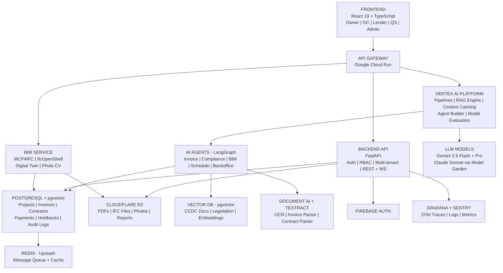
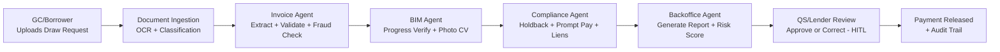

# SYSTEM ARCHITECTURE

## Component Topology

## Data Flow: Draw Request to Disbursement Report

---

## References

- [Google Cloud Run](https://cloud.google.com/run)
- [Vertex AI Platform](https://cloud.google.com/vertex-ai)
- [LangGraph](https://langchain-ai.github.io/langgraph/)
- [Supabase](https://supabase.com/)
- [Cloudflare R2](https://developers.cloudflare.com/r2/)
- [Google Document AI](https://cloud.google.com/document-ai)
- [Firebase Auth](https://firebase.google.com/products/auth)
- [Grafana Cloud](https://grafana.com/products/cloud/)
- [Sentry](https://sentry.io/)
- [Upstash Redis](https://upstash.com/)
